<div align="center">

<!-- PORTRAIT — scripts/dotify.py from assets/portrait-src.jpg (his GitHub avatar).
     Colour mode, one file for both GitHub themes. Regenerate with:
       python scripts/dotify.py assets/portrait-src.jpg -o assets/portrait \
         --cols 100 --equalize --detail 0.5 --color --invert --square -->
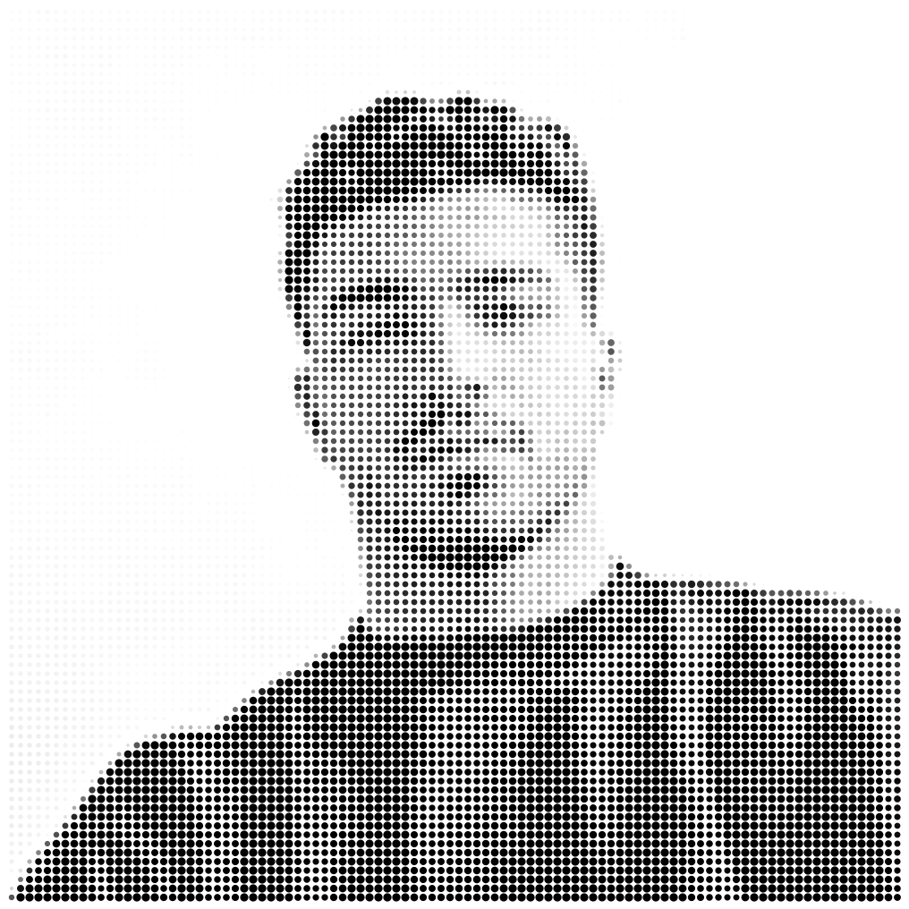

<br>

<a href="https://github.com/parsaforughi">
  
</a>

<br>

<a href="https://t.me/parsaforughi"></a>
<a href="https://github.com/parsaforughi/parsa-resume"></a>

</div>

---

## `~/` whoami

```console
$ cat about.txt
```

Hi, I'm **Parsa Forughi**. Product engineer. I ship apps and automations — Telegram products, mobile studios, live camera — then put the public work on GitHub.

- Shipping **[Reeldrive](https://github.com/parsaforughi/reeldrive)**, **[Bstory](https://github.com/parsaforughi/BOMA)**, **[VIP Passport](https://github.com/parsaforughi/seylane-vip)**
- Also shipping **[Collamin Shelftalker](https://github.com/parsaforughi/collamin-shelftalker)**, **[Pixxel UV](https://github.com/parsaforughi/pixxel-uv-effect)**, **[Viral](https://github.com/parsaforughi/telegram-viral-bot)**, **[Affiliate](https://github.com/parsaforughi/affiliate-instagram-bot)**
- Fun fact: **Most of these started as a tool I needed that week.**

<br>

<div align="center">

## `~/` toolbox


</div>

---

<div align="center">

## `~/` skill radar

<table>
<tr>
<td width="50%" align="center" valign="middle">

<!-- Self-rated radar — edit assets/skills.json, the workflow redraws it -->
<picture>
  <source media="(prefers-color-scheme: dark)"  srcset="assets/radar-dark.svg">
  <source media="(prefers-color-scheme: light)" srcset="assets/radar-light.svg">
  
</picture>

</td>
<td width="50%" align="center" valign="middle">

<!-- Live radar from language byte counts across public repos -->
<picture>
  <source media="(prefers-color-scheme: dark)"  srcset="assets/radar-langs-dark.svg">
  <source media="(prefers-color-scheme: light)" srcset="assets/radar-langs-light.svg">
  
</picture>

</td>
</tr>
</table>

</div>

---

<div align="center">

## `~/` contribution calendar

<!-- Isometric calendar — .github/workflows/metrics.yml -->


<br><br>

<!-- Snake — Platane/snk, .github/workflows/generate-snake.yml, output branch -->
<picture>
  <source media="(prefers-color-scheme: dark)"  srcset="https://raw.githubusercontent.com/parsaforughi/parsaforughi/output/github-contribution-grid-snake-dark.svg">
  <source media="(prefers-color-scheme: light)" srcset="https://raw.githubusercontent.com/parsaforughi/parsaforughi/output/github-contribution-grid-snake.svg">
  
</picture>

</div>

---

<div align="center">

## `~/` the numbers

<!-- Generated by scripts/cards.py into this repo. Files here, not a public badge host. -->
<picture>
  <source media="(prefers-color-scheme: dark)"  srcset="assets/card-stats-dark.svg">
  <source media="(prefers-color-scheme: light)" srcset="assets/card-stats-light.svg">
  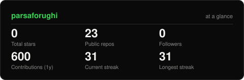
</picture>

</div>

---

<div align="center">

## `~/` selected work

<!-- Cards generated by scripts/cards.py from assets/projects.json. -->
<table>
<tr>
<td width="50%">
  <a href="https://github.com/parsaforughi/reeldrive">
    <picture>
      <source media="(prefers-color-scheme: dark)"  srcset="assets/card-reeldrive-dark.svg">
      <source media="(prefers-color-scheme: light)" srcset="assets/card-reeldrive-light.svg">
      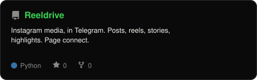
    </picture>
  </a>
</td>
<td width="50%">
  <a href="https://github.com/parsaforughi/BOMA">
    <picture>
      <source media="(prefers-color-scheme: dark)"  srcset="assets/card-BOMA-dark.svg">
      <source media="(prefers-color-scheme: light)" srcset="assets/card-BOMA-light.svg">
      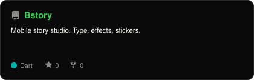
    </picture>
  </a>
</td>
</tr>
<tr>
<td width="50%">
  <a href="https://github.com/parsaforughi/seylane-vip">
    <picture>
      <source media="(prefers-color-scheme: dark)"  srcset="assets/card-seylane-vip-dark.svg">
      <source media="(prefers-color-scheme: light)" srcset="assets/card-seylane-vip-light.svg">
      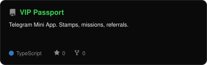
    </picture>
  </a>
</td>
<td width="50%">
  <a href="https://github.com/parsaforughi/collamin-shelftalker">
    <picture>
      <source media="(prefers-color-scheme: dark)"  srcset="assets/card-collamin-shelftalker-dark.svg">
      <source media="(prefers-color-scheme: light)" srcset="assets/card-collamin-shelftalker-light.svg">
      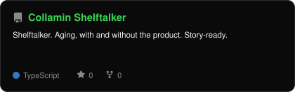
    </picture>
  </a>
</td>
</tr>
<tr>
<td width="50%">
  <a href="https://github.com/parsaforughi/pixxel-uv-effect">
    <picture>
      <source media="(prefers-color-scheme: dark)"  srcset="assets/card-pixxel-uv-effect-dark.svg">
      <source media="(prefers-color-scheme: light)" srcset="assets/card-pixxel-uv-effect-light.svg">
      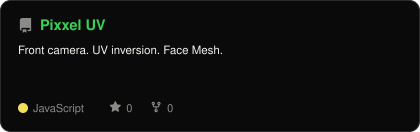
    </picture>
  </a>
</td>
<td width="50%">
  <a href="https://github.com/parsaforughi/telegram-viral-bot">
    <picture>
      <source media="(prefers-color-scheme: dark)"  srcset="assets/card-telegram-viral-bot-dark.svg">
      <source media="(prefers-color-scheme: light)" srcset="assets/card-telegram-viral-bot-light.svg">
      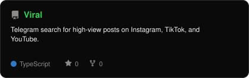
    </picture>
  </a>
</td>
</tr>
<tr>
<td width="50%">
  <a href="https://github.com/parsaforughi/affiliate-instagram-bot">
    <picture>
      <source media="(prefers-color-scheme: dark)"  srcset="assets/card-affiliate-instagram-bot-dark.svg">
      <source media="(prefers-color-scheme: light)" srcset="assets/card-affiliate-instagram-bot-light.svg">
      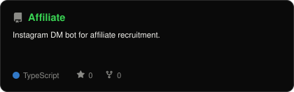
    </picture>
  </a>
</td>
<td width="50%"></td>
</tr>
</table>

<sub>

| project | live | stack |
|---|---|---|
| **[Reeldrive](https://github.com/parsaforughi/reeldrive)** | — | `Python` `Telegram` |
| **[Bstory](https://github.com/parsaforughi/BOMA)** | — | `Flutter` `Dart` |
| **[VIP Passport](https://github.com/parsaforughi/seylane-vip)** | — | `TypeScript` `JavaScript` |
| **[Collamin Shelftalker](https://github.com/parsaforughi/collamin-shelftalker)** | — | `Next.js` `TypeScript` |
| **[Pixxel UV](https://github.com/parsaforughi/pixxel-uv-effect)** | — | `JavaScript` |
| **[Viral](https://github.com/parsaforughi/telegram-viral-bot)** | — | `TypeScript` `Node` |
| **[Affiliate](https://github.com/parsaforughi/affiliate-instagram-bot)** | [affiliate-instagram-bot.vercel.app](https://affiliate-instagram-bot.vercel.app) | `TypeScript` `JavaScript` |

</sub>

</div>

---

<div align="center">

<sub><code>~/ eof</code></sub>

</div>
