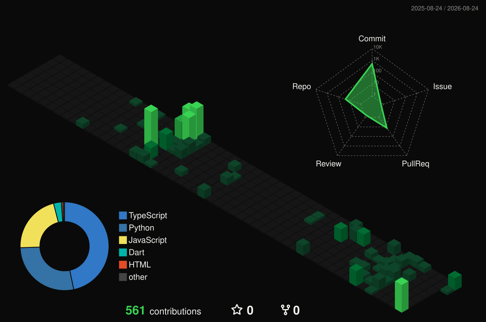

<div align="center">

<!-- Dark studio banner. Typography only — no portrait. -->


<br>

<!-- Name + rotating product taglines -->
<a href="https://github.com/parsaforughi">
  
</a>

<br>

<a href="https://t.me/parsaforughi"></a>
<a href="https://github.com/parsaforughi/parsa-resume"></a>


</div>

---

## `~/` whoami

```console
$ cat about.txt
```

Hi, I'm **Parsa Forughi**. Product engineer. I ship apps and automations — Telegram products, mobile studios, live camera — then put the public work on GitHub.

- Shipping **[Reeldrive](https://github.com/parsaforughi/reeldrive)**, **[Bstory](https://github.com/parsaforughi/BOMA)**, **[VIP Passport](https://github.com/parsaforughi/seylane-vip)**
- Also shipping **[Collamin Shelftalker](https://github.com/parsaforughi/collamin-shelftalker)**, **[Pixxel UV](https://github.com/parsaforughi/pixxel-uv-effect)**, **[Viral](https://github.com/parsaforughi/telegram-viral-bot)**, **[Affiliate](https://github.com/parsaforughi/affiliate-instagram-bot)**
- Fun fact: **Most of these started as a tool I needed that week.**

<br>

<div align="center">

## `~/` toolbox


</div>

---

<div align="center">

## `~/` skill radar

<!-- Language mix via github-readme-stats (shion.dev — official vercel.app instance is paused). -->
<table>
<tr>
<td width="50%" align="center" valign="middle">


</td>
<td width="50%" align="center" valign="middle">


</td>
</tr>
</table>

</div>

---

<div align="center">

## `~/` contribution calendar

<!-- 3D isometric calendar — .github/workflows/profile-3d.yml -->


<br><br>

<!-- Snake — Platane/snk, .github/workflows/generate-snake.yml -->
<picture>
  <source media="(prefers-color-scheme: dark)" srcset="output/github-contribution-grid-snake-dark.svg" />
  <source media="(prefers-color-scheme: light)" srcset="output/github-contribution-grid-snake.svg" />
  
</picture>

</div>

---

<div align="center">

## `~/` the numbers


<br>


<br>


</div>

---

<div align="center">

## `~/` selected work

| project | live | stack |
|---|---|---|
| **[Reeldrive](https://github.com/parsaforughi/reeldrive)** | — | `Python` `Telegram` |
| **[Bstory](https://github.com/parsaforughi/BOMA)** | — | `Flutter` `Dart` |
| **[VIP Passport](https://github.com/parsaforughi/seylane-vip)** | — | `TypeScript` `JavaScript` |
| **[Collamin Shelftalker](https://github.com/parsaforughi/collamin-shelftalker)** | — | `Next.js` `TypeScript` |
| **[Pixxel UV](https://github.com/parsaforughi/pixxel-uv-effect)** | — | `JavaScript` |
| **[Viral](https://github.com/parsaforughi/telegram-viral-bot)** | — | `TypeScript` `Node` |
| **[Affiliate](https://github.com/parsaforughi/affiliate-instagram-bot)** | [affiliate-instagram-bot.vercel.app](https://affiliate-instagram-bot.vercel.app) | `TypeScript` `JavaScript` |

</div>

---

<div align="center">

<sub><code>~/ eof</code></sub>

</div>
