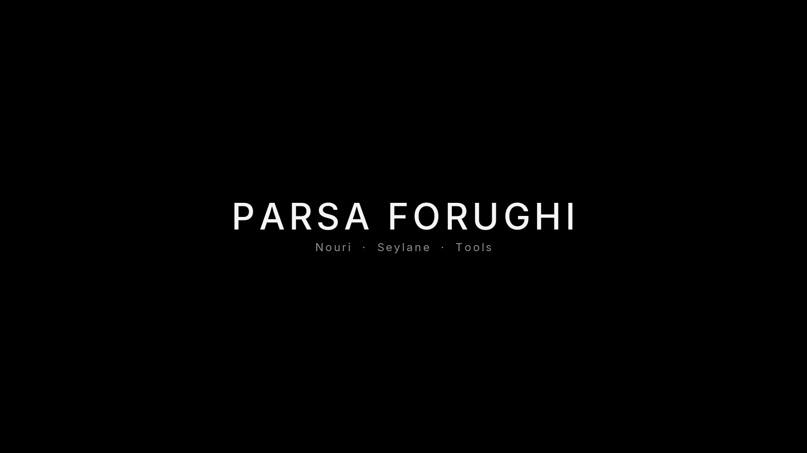

  

Product systems for brand houses.

## Nouri

**[Reeldrive](https://github.com/parsaforughi/reeldrive)**  
Instagram media, in Telegram. Posts, reels, stories, highlights. Page connect.

**[Bstory](https://github.com/parsaforughi/BOMA)**  
Mobile story studio. Type, effects, stickers.

## Seylane

**[MastermindOS](https://github.com/parsaforughi/mastermindos-dashboard)**  
Dashboard for bots and automation. Monitor, measure, control.

**Pixxel**  
Camera filters.  
[Age](https://github.com/parsaforughi/pixxel-age-filter) · [UV](https://github.com/parsaforughi/pixxel-uv-effect)

**IceBall**  
Winter campaign portraits from a face and a product still.  
[Trend](https://github.com/parsaforughi/iceball-trend-generator) · [Christmas](https://github.com/parsaforughi/iceball-christmas)

**[Collamin](https://github.com/parsaforughi/collamin-shelftalker)**  
Shelftalker. Aging, with and without the product. Story-ready.

**[VIP](https://github.com/parsaforughi/seylane-vip)**  
VIP Passport. Telegram client and API.

## Tools

**[Directam Pro](https://github.com/parsaforughi/directam-pro)**  
Comment-to-DM on Meta’s official Instagram API.

**[Viral](https://github.com/parsaforughi/telegram-viral-bot)**  
Telegram search for high-view posts on Instagram, TikTok, and YouTube.

**[Drive → Telegram](https://github.com/parsaforughi/gdrivetotl)**  
Public Drive link in. File out.

---

<a href="https://t.me/parsaforughi">Telegram</a>

